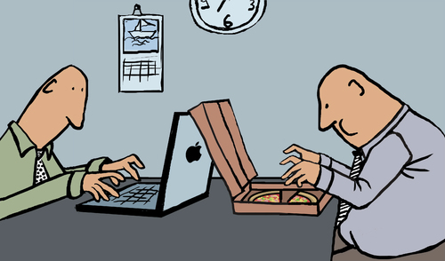

# Decentralized Pizza (DePi) License v1.0

Image By: [Mistviech](https://www.toonpool.com/cartoons/Pizza-Laptop_128339)
## What is this License About?
This license is heavily inspired by both ["Don't Be A Dick" License (DBAD)](http://dbad-license.org/)
and the Decentralized Pizza (DePi) meme.

This license is if you REALLY don't care what happens to your project (unlicensed) but want to make sure
people behave like citizens who respect the decentralization of pizza, and therefore your work here.

Pizza is the most decentralized concept in the world. It's created in so many countries around the world using countless
different recipes. Pizza recipes are shared worldwide and great ingredients are sought out.

Like pizza and pizza recipes, this license is intended if you would like your work to be shared as if it was a pizza recipe around the world but by citizens who will pay respect to you the original pizza chef and software creator.

## How to Use this License?
This LICENSE isn't intended to be legal counsel whatsoever.

The LICENSE file in the root repository is the Decentralized Pizza License. Modify the copyright year and name before 
using it.
